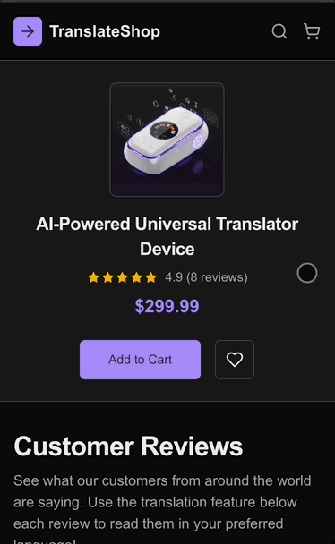

# Chrome Translation API Demo

A live demonstration of Chrome's built-in Translation and Language Detection APIs, showcasing on-device AI translation with multilingual product reviews.

🔗 **[Live Demo](https://web-ai-translation-demo.davebitter.com/)** | 📦 **[GitHub Repository](https://github.com/DaveBitter/web-ai-translation-demo)** | 📝 **[Read the Article](https://techhub.iodigital.com/articles/building-a-translation-demo-with-chromes-built-in-ai-apis)**



## 🌟 Features

- **Language Detection API**: Automatically detects the language of each review using Chrome's built-in AI
- **Translation API**: Translate reviews on-demand to your preferred language
- **On-Device Processing**: All AI processing happens locally using Google's Gemini Nano model
- **Privacy-First**: No data leaves your device
- **Beautiful UI**: Built with Next.js 16, Radix UI, and Tailwind CSS 4
- **Fully Responsive**: Works seamlessly across desktop, tablet, and mobile

## 🚀 Getting Started

### Prerequisites

- **Chrome 138 or later** (currently at version 141+)
- At least 22GB of free disk space
- 4GB+ VRAM

### Enable Chrome Flags

1. Navigate to `chrome://flags/#language-detection-api`
2. Enable the **"Language Detection API"** flag
3. Navigate to `chrome://flags/#optimization-guide-on-device-model`
4. Enable **"Optimization Guide On Device Model"**
5. **Restart Chrome**
6. Go to `chrome://components/`
7. Find **"Optimization Guide On Device Model"** and click **"Check for update"**

### Run the Demo

```bash
npm install
npm run dev
```

Open [http://localhost:3000](http://localhost:3000) with your browser.

## 📝 How It Works

1. **Page Load**: The demo automatically detects the language of each review
2. **Language Badge**: Each review shows a badge with the detected language
3. **System Language**: Reviews in your system language are highlighted
4. **Translation**: Select a target language and click "Translate"
5. **Model Download**: On first use, the translation model downloads (1-2GB)
6. **View Toggle**: Switch between original and translated text anytime

## 🛠️ Tech Stack

- **Next.js 16** (App Router)
- **React 19**
- **TypeScript 5**
- **Tailwind CSS 4**
- **Radix UI** (Dialog, Select, Label, etc.)
- **Chrome's Translation API** (experimental)
- **Chrome's Language Detection API** (experimental)

## 📚 Resources

- [Chrome AI Built-in APIs Documentation](https://developer.chrome.com/docs/ai/built-in-apis)
- [Language Detection API](https://developer.chrome.com/docs/ai/language-detection)
- [Translation API](https://developer.chrome.com/docs/ai/translator)
- [Original Article](https://techhub.iodigital.com/articles/built-in-ai-in-chrome)

## 👨‍💻 Author

**Dave Bitter** - Google Developer Expert

## 📄 License

This project is open source and available for demonstration purposes.

## 🙏 Acknowledgments

- Chrome team for the built-in AI APIs
- Radix UI for accessible component primitives
- Vercel for Next.js and hosting
